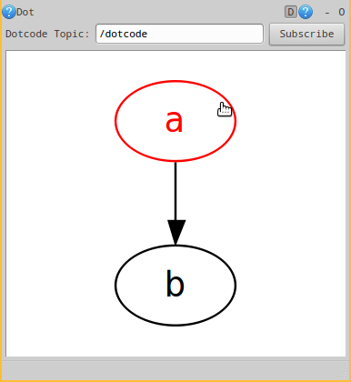

rqt dot
=======

This is a simple rqt-based ROS GUI for visualizing graphviz dotcode
published over a ROS `std_msgs/String` topic.

## Usage Example

First, open the `rqt_dot` GUI:

```
rosrun rqt_dot rqt_doe
```

Second, subscribe to a ROS topic by entering it by name and clicking
the `Subscribe` button.

Third, publish some dotcode from somewhere, like the command line:

```
rostopic pub -r 1 /dotcode std_msgs/String "data: digraph foo { a; b; a ->b; }"
```

Finally, see the result:


